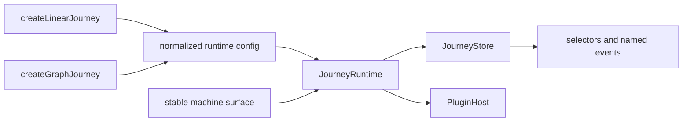
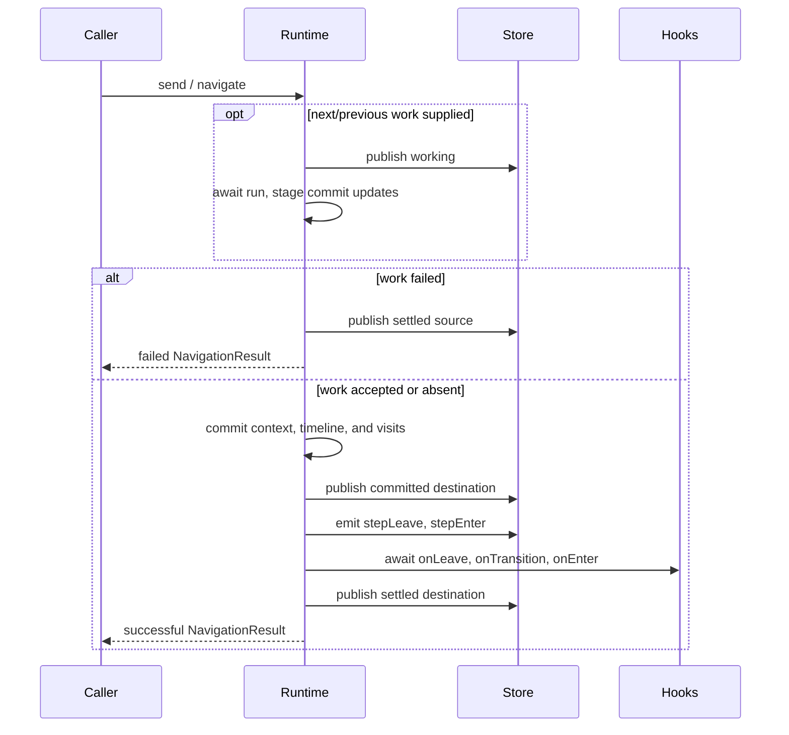

# How it works

V1 has one runtime for linear and graph journeys. Factories normalize their definition shape into a
small shared configuration, `JourneyRuntime` owns changing state, `JourneyStore` distributes
snapshots and named events, and a stable machine surface delegates to the runtime.



## The shape of a machine {#the-shape-of-a-machine}

`buildMachineSurface` creates the public object once. Its grouped methods close over a runtime; they
do not hold independent copies of journey state.

```text
machine
  getSnapshot()
  controls.*
  navigate.*
  subscriptions.*
  context.update()
  plugins.*
  send()              graph only
```

Everything that changes is rebuilt into an immutable linear or graph snapshot.

## Resolving definitions {#resolving-the-definition}

`createLinearJourney` validates a non-empty, duplicate-free step tuple, normalizes string shorthand,
and uses the first id as `initial`.

`createGraphJourney` validates a non-empty step record, the initial id, and every transition source
and target. It flattens the event-keyed transition map in declaration order. That order determines
which enabled candidate wins.

Both factories pass the runtime:

- kind, step ids, and normalized step configs;
- initial id and context;
- flattened graph transitions, or an empty list for linear;
- handlers, options, and plugins.

The graph builder is an authoring transform. Its `build()` result enters the same graph normalizer.

## Runtime state {#runtime-state}

`JourneyRuntime` owns status, context, outcome, timeline, pointer, visit counts, current entry async
state, pending transition state, raised events, generation, and plugin contributions.

No controller-per-concern layer sits between this state and the operation changing it. A lifecycle
control, context update, navigation, or graph send updates runtime state and publishes a new
snapshot at its defined boundaries.

## The store {#the-store}

`JourneyStore` has two jobs:

1. Hold the latest snapshot and notify selector listeners when their selected value changes.
2. Deliver named lifecycle payloads to listeners for that event.

Selector and event-listener failures are caught and reported so one subscriber cannot interrupt the
runtime or other subscribers.

## Sending a graph event {#sending-an-event}

`send(type, payload?)` follows this selection path:

1. Reject if disposed, not running, or already transitioning.
2. Scan flattened transitions in declaration order.
3. Match event type and current `from` id.
4. Evaluate the synchronous guard, if present.
5. Run navigation with the first enabled candidate.

No match returns `no-enabled-transition`. A throwing guard is treated as disabled because guards are
also evaluated during snapshot derivation.

## Committing a move {#committing-a-move}



Pointer moves update only `currentIndex`. Appending a destination truncates timeline entries after
the pointer, then appends the new id.

## Async state {#async-state}

The runtime exposes two related views:

- `snapshot.transition` describes the whole pending operation (`working`, `leaving`, or `entering`);
- `snapshot.currentStep.async` describes navigation work or lifecycle effects.

Navigation work runs before commit and may stop movement. `onLeave`, graph `onTransition`, and
destination `onEnter` run after commit. Their failure is stored on the destination and emitted as
an `error` event without rollback.

`defaultTimeoutMs` wraps navigation `run` and each hook promise. Terminate, restart, and dispose
increment a generation counter so stale continuations cannot settle a newer run.

## Raised events {#raised-events}

Hook `raise(event)` appends to a graph-only FIFO. The runtime starts draining only after the current
transition settles. One cascade is capped at `MAX_RAISED_EVENTS` (25); exceeding it drops the queue
and emits an error with phase `raise`.

## Lifecycle and context changes {#out-of-band-changes}

Controls update status directly and publish a snapshot plus `statusChange`. Context updates replace
context synchronously and publish a snapshot plus `contextChange`.

Pause, complete, and normal navigation reject while a hook chain is pending. Terminate deliberately
wins: it invalidates pending work and clears raised events. Restart is available only after complete
or terminate and rebuilds the initial run state.

## Plugins {#plugins}

Plugins are initialized once with an observe-only `PluginHost`. The host exposes the current
snapshot, a frozen structural definition view, observation taps, and disposal registration.

A plugin setup may return:

- `api`, exposed at `machine.plugins[name]`;
- `deriveSnapshot`, exposed at `snapshot.plugins[name]`.

Extensions are namespaced. Duplicate names fail creation. Plugin observer exceptions are isolated,
and plugins cannot intercept or replace core transitions.

## Snapshot derivation {#snapshot-derivation}

Every publish rebuilds shared fields, then adds kind-specific fields:

- linear derives order index, first/last flags, step order, and totals;
- graph re-evaluates guards to derive unique available events and targets plus terminal state;
- plugin snapshot derivers run last and receive their previous extension for memoization.

The completed object and its nested runtime-owned records/arrays are frozen.

## Source map {#source-map}

| File                   | Responsibility                                                         |
| ---------------------- | ---------------------------------------------------------------------- |
| `src/linear/linear.ts` | Linear definition normalization and factory.                           |
| `src/graph/graph.ts`   | Graph normalization, factory, and `send` surface.                      |
| `src/graph/builder.ts` | Colocated graph authoring transform.                                   |
| `src/core/runtime.ts`  | Lifecycle, navigation, hooks, history, events, plugins, and snapshots. |
| `src/core/machine.ts`  | Stable grouped public machine object.                                  |
| `src/core/store.ts`    | Snapshot holder, selectors, and named event delivery.                  |
| `src/core/types.ts`    | Shared public contracts.                                               |

## Where to next

- [Machine API](./api/machine-api)
- [Snapshot](./snapshot)
- [Writing a plugin](./plugins/authoring)
