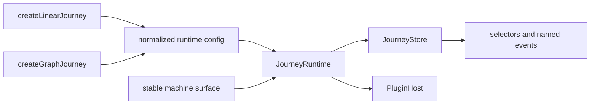

# How it works

V1 has one runtime for linear and graph journeys. Factories normalize their definition shape into a
small shared configuration, `JourneyRuntime` owns changing state, `JourneyStore` distributes
snapshots and named events, and a stable machine surface delegates to the runtime.

Everything that changes is rebuilt into an immutable linear or graph snapshot. The machine object
itself never changes after creation.

## Resolving definitions {#resolving-the-definition}

`createLinearJourney` validates a non-empty, duplicate-free step tuple, normalizes string shorthand,
and uses the first id as `initial`.

`createGraphJourney` validates a non-empty step record, the initial id, and every transition source
and target. It flattens the event-keyed transition map in declaration order. That order determines
which enabled candidate wins.

Both factories pass the runtime:

- kind, step ids, and normalized step configs;
- initial id and context;
- flattened graph transitions, or an empty list for linear;
- handlers, options, and plugins;
- a restore seed when the `persist` option finds a resumable record (see
  [Runtime](./architecture/runtime)).

The graph builder is an authoring transform. Its `build()` result enters the same graph normalizer.

## The pieces

| Page                                                        | Covers                                                                    |
| ----------------------------------------------------------- | ------------------------------------------------------------------------- |
| [Runtime](./architecture/runtime)                           | `JourneyRuntime`: status, timeline, context, generation, raised events.   |
| [Store](./architecture/store)                               | `JourneyStore`: snapshot holder, subscription hub, listener isolation.    |
| [Machine surface](./architecture/machine-surface)           | `buildMachineSurface`: the grouped public object.                         |
| [Plugin host](./architecture/plugin-host)                   | Observe-only taps, namespaced APIs, snapshot extension stability.         |
| [Work and transitions](./architecture/work-and-transitions) | Sync guards, transactional work, result routing, and the commit pipeline. |

## Snapshot derivation {#snapshot-derivation}

Every publish rebuilds shared fields, then adds kind-specific fields:

- linear derives order index, first/last flags, step order, and totals;
- graph re-evaluates guards to derive unique available events and targets plus terminal state;
- plugin snapshot derivers run last and receive their previous extension for memoization.

The completed object and its nested runtime-owned records/arrays are frozen.

## Source map {#source-map}

| File                   | Responsibility                                                         |
| ---------------------- | ---------------------------------------------------------------------- |
| `src/linear/linear.ts` | Linear definition normalization and factory.                           |
| `src/graph/graph.ts`   | Graph normalization, factory, and `send` surface.                      |
| `src/graph/builder.ts` | Colocated graph authoring transform.                                   |
| `src/core/runtime.ts`  | Lifecycle, navigation, hooks, history, events, plugins, and snapshots. |
| `src/core/machine.ts`  | Stable grouped public machine object.                                  |
| `src/core/store.ts`    | Snapshot holder, selectors, and named event delivery.                  |
| `src/core/types.ts`    | Shared public contracts.                                               |

Files and classes under `packages/core/src` are implementation details. Import only from package
export paths; see the [stability contract](./stability).

## Where to next

- [Machine API](./api/machine-api)
- [Snapshot](./snapshot)
- [Writing a plugin](./plugins/authoring)
