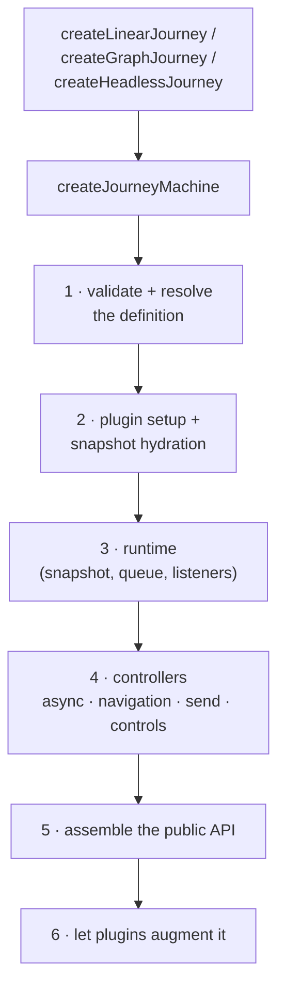
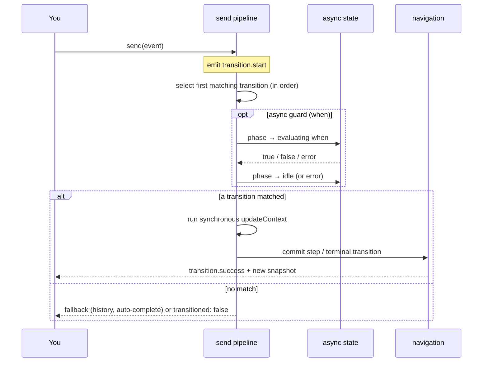

# How it works

You can use Journey without reading any of this. But when you're debugging something subtle —
why a guard didn't fire, why two updates landed in a surprising order, why a back-step kept its
history — it helps to know what the runtime does on your behalf. So let's follow a flow from the
moment you author it to the moment an event commits a new snapshot.

Everything here lives in `packages/core/src/journey-machine`. The [Source map](#source-map) at the
bottom links each part to its file if you want to read along.

## The shape of a machine

When you call a factory, Journey assembles a small set of cooperating pieces and hands you one
object. The assembly happens in a deliberate order.

The order isn't arbitrary — each step depends on the one before it:

- The **resolver** has to run first, because nothing can evaluate transitions until they're in the
  runtime's single normalized shape.
- **Plugin hydration** has to happen before the runtime owns its first snapshot, so a plugin like
  persistence can load saved state _into_ the initial snapshot rather than racing it afterward.
- The **runtime** has to exist before the async, navigation, send, and controls controllers can
  commit anything through it.
- **Plugin augmentation** comes last, so the machine you get back is already complete when a plugin
  adds methods to it.

That ordering is what keeps every controller small and free of hidden initialization
dependencies. The three public factories each normalize their input into one `JourneyDefinition`
before any of this runs, so everything below is the shared layer underneath all three modes.

## Resolving the definition {#resolving-the-definition}

You can author transitions in a few shapes — an ordered array for linear, an event-keyed object
for graph, or nothing at all for headless. The runtime executes only one shape: **an ordered list
of transitions**. The resolver's job is to flatten whatever you wrote into that list.

- An **array** is read as a linear declaration: each entry must be a known step, the first must
  match `initial`, and the array expands into implicit `goToNextStep` edges between neighbors.
- An **object graph** is validated layer by layer (`from → event → edges[]`) and flattened into
  ordered transition objects.
- The **`global`** branch is resolved last and rewritten to `from: "*"`, so global handlers act as
  a fallback _after_ a step's own transitions for the same event.

The guarantee that matters here is **order**. The send pipeline scans transitions top to bottom and
takes the first match, so the resolver preserves your authoring order while giving the runtime one
deterministic structure to evaluate. (The public authoring shapes are documented in
[Transitions syntax](/docs/core/api/transitions-syntax).)

## The runtime queue {#the-runtime-queue}

The runtime is the mutable heart of the machine. It owns the current snapshot, the subscription
sets, the lifecycle event stream, and — the part worth understanding — a **serialized execution
queue**.

Every send and every navigation helper is chained onto one queue. Each operation runs to a stable
result before the next one is allowed to mutate the machine. That single rule is why you never see
a half-applied state: no two events overlap.

:::tip
When you `await machine.goToNextStep()` and then `await machine.updateContext(...)`, the context
update doesn't race the navigation — it waits its turn in the same queue and rebases on whatever
snapshot the navigation committed.
:::

The queue also handles **cancellation**. Each queued operation captures a run version. If the
machine resets (or otherwise cancels in-flight work), the version increments — and any older async
work that's still running locally will finish, but its writes are ignored because they belong to a
stale run. This is how a `resetJourney()` in the middle of an async guard doesn't get clobbered by
that guard resolving a moment later.

Listeners are isolated too: if one subscriber throws, the runtime reports it (through your
`onListenerError`, or a dev-only `console.error`) rather than letting it break the machine or the
other listeners.

## Sending an event {#sending-an-event}

Here's the interesting part — what happens between `machine.send(...)` and a new snapshot. Inside
the queue, one event takes this trip:

Walking through it:

1. The pipeline confirms the machine is still `running` and emits `transition.start`. (If the
   machine was disposed, the send resolves with a `JourneyDisposedError` instead of throwing.)
2. **Headless** definitions short-circuit: `goToStepById` commits a direct jump, while
   `goToNextStep` and custom events resolve as no-ops because there are no transitions to match.
3. Transition selection scans the ordered list filtered by `from` and `event`, evaluating guards
   in order and taking the first that passes. While an async guard runs, the source step's
   `async` phase is set to `evaluating-when`, and a run-scoped `AbortSignal` is passed into the
   guard so it can bail if the run is cancelled.
4. If selection throws or times out, the pipeline records step error state, emits
   `transition.error`, and resolves the send result with `error` — it does **not** reject the
   promise. Failure is a value you inspect, not an exception you catch.
5. If nothing matched, built-in fallbacks apply: `goToPreviousStep` falls back to history
   navigation, and `goToNextStep` can auto-complete the journey (unless
   `requireExplicitCompletion` is set).
6. If a transition matched, its synchronous `updateContext` runs to derive the next context, and
   the commit is delegated to navigation.

Notice what the send pipeline does _not_ do: it doesn't own the queue, it doesn't build the
snapshot, and it doesn't store async state. It orchestrates; other pieces commit. That separation
is what keeps each one readable on its own.

## Committing a move {#committing-a-move}

Once a target is known, navigation turns that decision into a new snapshot and the right lifecycle
events. The key idea is that **history is a realized path plus a pointer**, not a single index into
your authored steps.

- A **step transition** validates the target, emits `step.exit` (if the step actually changes),
  commits the snapshot, emits `transition.success`, then emits `step.enter`.
- **Previous-step navigation** moves the pointer backward without destroying the timeline — it
  emits `step.exit`, commits with reason `"navigation"`, emits `navigation.previous`, then
  `step.enter`.
- A **terminal transition** keeps the realized timeline up to the pointer, flips status to
  `completed` or `terminated`, and emits the matching event.

Because back is a pointer move rather than a rewrite, you keep both the true history of what
happened and a current position within it. [Timeline & history](/docs/core/history) covers the
user-facing side, including what happens when you move forward after stepping back.

## Async state {#async-state}

Async truth lives in the snapshot, not in a hidden flag. A dedicated controller owns
`snapshot.async`, exposing three phases per step — `idle`, `evaluating-when`, and `error` — plus a
machine-wide `isLoading` derived from how many steps are currently loading.

Every async write is run-version aware: before committing, the controller checks that the run is
still active, so cancelled work can't mutate a newer run. Because the state lives in the snapshot,
your UI, your plugins, and your devtools all read the same async truth.
[Async behavior](/docs/core/async) is the user-facing guide.

## Out-of-band changes {#out-of-band-changes}

Not every change is a transition. Resetting the machine, updating context directly, and clearing a
step error all bypass transition matching — but they still go through the same queue, so they apply
in order and rebase on the latest snapshot. `resetJourney()` cancels in-flight work and rebuilds a
clean idle snapshot; `updateContext(...)` commits a new context with reason `"context"`;
`clearStepError(...)` hands off to the async controller. Keeping these out of the send pipeline is
what lets transition-driven movement stay honest.

## Plugins {#plugins}

Plugins are wired in by a narrow controller that runs each `plugin.setup(...)` once, organizes the
hooks it returns, and calls them at the right moments: hydrating the initial snapshot, fanning out
every committed change, and augmenting the public machine. If a plugin's setup throws, already-set-up
plugins are disposed in reverse order and the error is re-thrown tagged with the plugin name. The
controller also refuses method collisions, so one plugin can't silently shadow the machine's API or
another plugin's. [Plugins](/docs/core/plugins/overview) is the full extension guide.

## Source map

If you want to read the implementation, here's where each responsibility lives under
[`packages/core/src/journey-machine`](https://github.com/rxova/journey/tree/main/packages/core/src/journey-machine):

| File                            | Owns                                                                                    |
| ------------------------------- | --------------------------------------------------------------------------------------- |
| `index.ts`                      | Validates and resolves the definition, builds the controllers in order, exposes the API |
| `resolve-journey-definition.ts` | Normalizes authored transitions into the single ordered list the runtime executes       |
| `runtime.ts`                    | The live snapshot, listeners, selector listeners, and the serialized async queue        |
| `send.ts`                       | Resolves an event into a transition, runs guards and context updates, delegates commit  |
| `navigation.ts`                 | Commits step changes, terminal states, and history-pointer moves                        |
| `async-state.ts`                | Owns `snapshot.async` and keeps `isLoading` in sync                                     |
| `controls.ts`                   | Out-of-band mutations: reset, context updates, error clearing, disposal                 |
| `plugin-controller.ts`          | Plugin setup, hydration, snapshot-change hooks, augmentation, disposal                  |
| `helpers.ts`                    | Pure utilities: validation, snapshot construction, transition selection, timeouts       |

## Where to next

- [Snapshot](/docs/core/snapshot) — the object every commit produces.
- [Lifecycle & events](/docs/core/lifecycle) — the event stream this pipeline emits, in order.
- [Async behavior](/docs/core/async) — guards, timeouts, and the `async` phases up close.
- [Timeline & history](/docs/core/history) — the realized-path model behind back and revisit.
