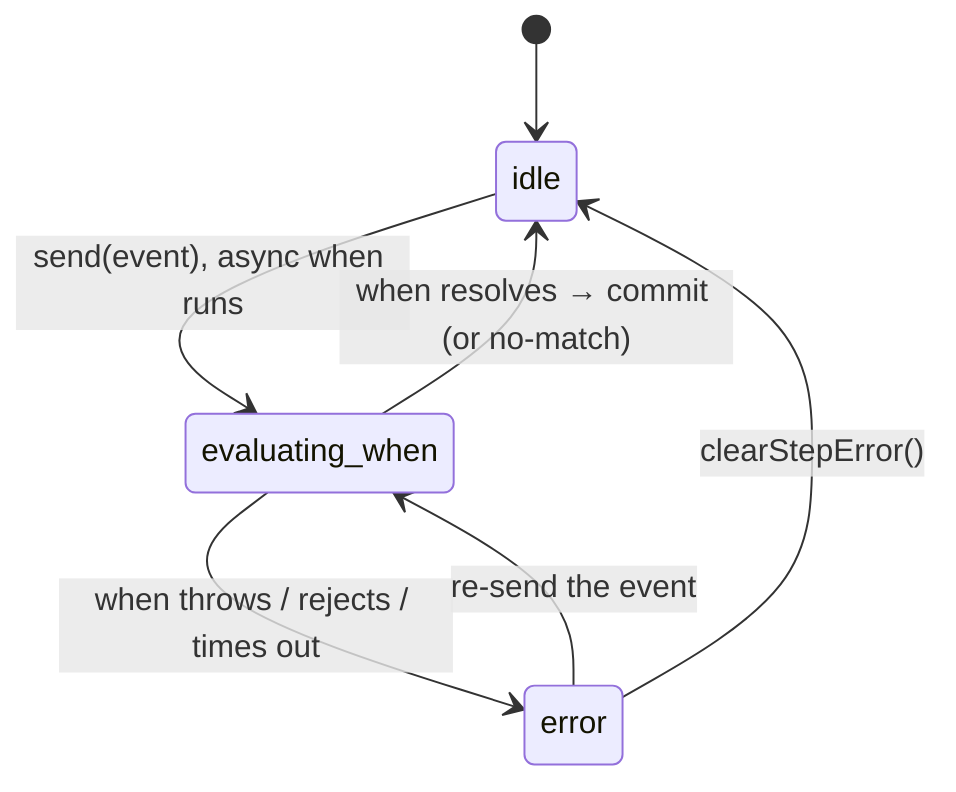

# Async behavior

Most flows have to wait on something — validate a card, check eligibility, confirm a coupon. In
Journey, that waiting is part of the model: a transition's guard can be async, and while it runs the
step carries a visible loading phase you can render. The writes themselves stay synchronous and
queued, so async work never produces a half-applied state.

## Guard vs. update

A transition has two distinct jobs, and only one of them can be async:

| Part            | Job                                      | Runs                           | Async? | Can change context? |
| --------------- | ---------------------------------------- | ------------------------------ | ------ | ------------------- |
| `when`          | decide whether the transition is allowed | before the commit              | yes    | no                  |
| `updateContext` | derive the next context                  | only for the chosen transition | no     | yes                 |

Think of `when` as a permission check and `updateContext` as the synchronous write that follows once
permission is granted.



The active step's phase lives in `snapshot.async.byStep[stepId]`, and `snapshot.async.isLoading`
answers the machine-wide question "is any async transition work in flight right now?"

## Async guards

Use `when` to decide whether a transition may fire. It receives one args object and may return a
boolean or a promise of one:

```ts
{
  from: "payment",
  event: "goToNextStep",
  to: "review",
  when: async ({ context, handlers, signal }) => {
    return handlers.validateCard(context.cardToken, { signal });
  }
}
```

The full args:

```ts
when: async ({ snapshot, context, from, timeline, index, event, signal, handlers }) => true;
```

`signal` is a run-scoped `AbortSignal` — when the run is cancelled (say, a `resetJourney()` lands),
the signal aborts so your guard can stop waiting instead of resolving into a stale run.

## Synchronous context updates

`updateContext` derives the next context from the current one and the triggering event. It's
synchronous on purpose:

```ts
{
  from: "details",
  event: "draftSaved",
  to: "review",
  updateContext: ({ context, event }) => ({
    ...context,
    draftId: event.payload?.draftId ?? null
  })
}
```

If you need async work to _produce_ data for the next state, do that work before `send(...)` and
pass the resolved data in the event payload. Keep this rhythm in mind:

> Async work **decides**. Events **carry** resolved data. `updateContext` **commits** the next
> context, synchronously.

## Phases and how to render them

Per-step phases map cleanly onto UI states:

| Phase             | Render as                                   |
| ----------------- | ------------------------------------------- |
| `idle`            | normal, interactive                         |
| `evaluating-when` | disable controls / show a validating state  |
| `error`           | a recoverable error with a retry affordance |

## Timeouts

Cap an async guard with `timeoutMs`:

```ts
{
  id: "payment-review",
  from: "payment",
  event: "goToNextStep",
  to: "review",
  timeoutMs: 5_000,
  when: async ({ context, handlers, signal }) => {
    return handlers.validateCard(context.cardToken, { signal });
  }
}
```

If the work doesn't settle in time, Journey resolves the send with `transitioned: false`, emits
`transition.error`, and moves the source step into the `error` phase. Re-sending the event retries
from `idle`.

## Updates during in-flight async work

Every write shares one queue, which removes a whole category of race conditions:

- A running async `when` keeps the args it started with — it won't see a context change mid-flight.
- An external `updateContext()` call waits in the same queue rather than racing a second write lane.
- If a context change must affect the _current_ decision, apply it before `send(...)` or include it
  in the event payload.

Lifecycle helpers (`handlers`, `onEnter`, `onLeave`) may also do async work, but they're
observational — they don't define a phase in `snapshot.async`, and failures there are logged as
diagnostics rather than surfaced as `transition.error`. See
[How it works → Async state](/docs/core/architecture#async-state) for the runtime side.

## Where to next

- [Lifecycle & events](/docs/core/lifecycle) — `transition.error` and the event ordering around failures.
- [Snapshot](/docs/core/snapshot) — the `async` branch in the read model.
- [Graph mode](/docs/core/usage/graph) — guards and updates in a worked flow.
