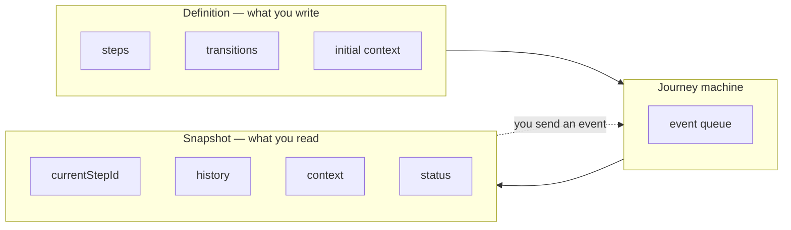
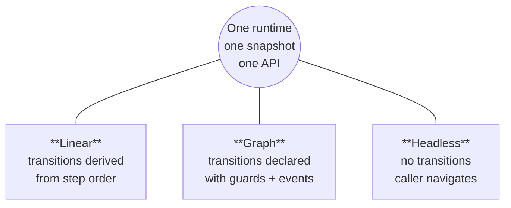
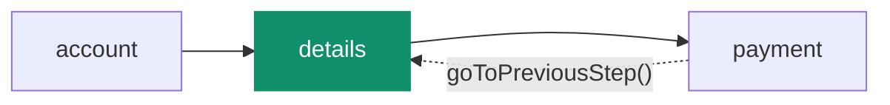

# Core concepts

Every page in these docs leans on the same handful of words: _step_, _transition_, _guard_,
_context_, _snapshot_, _history_. This page defines them all in one place, using one running
example — a checkout flow — so the rest of the docs can build on a vocabulary you already have.

If you've just finished the [Quickstart](/docs/core/getting-started), this is the page that
explains _why_ the code you ran did what it did. Read it once, then refer back whenever a term
shows up later.

## The mental model in one picture

A Journey machine has two halves, and keeping them straight is most of the battle.

- The **definition** is what you write. It's static: the steps, the rules for moving between
  them, the starting context. You author it once and it doesn't change while the flow runs.
- The **snapshot** is what you read. It's live: where you are right now, how you got here, the
  current data, whether you're done. The machine produces a fresh snapshot every time something
  moves.



You drive the machine by sending events. The machine runs your rules, settles any async work, and
commits a new snapshot. Your UI reads that snapshot and renders. That loop is the whole library.

:::tip
Definition is the map. Snapshot is your location on it. You edit the map at author time; you read
your location at runtime.
:::

## Steps

A **step** is a named place in your flow — `"account"`, `"payment"`, `"review"`. Steps are
referenced by id, never by array position, so reordering or branching your flow doesn't break
navigation.

A step can carry static **metadata** (a label, an icon, a help string) that never changes at
runtime. You read it with `getStepMeta(id)`, and it lives outside the snapshot because it's part
of the definition, not the live state.

```ts
const machine = createLinearJourney<Context, StepId, StepMeta>({
  context: { email: "" },
  steps: [
    { id: "account", meta: { label: "Account" } },
    { id: "payment", meta: { label: "Payment" } },
    { id: "review", meta: { label: "Review" } }
  ]
});

machine.getStepMeta("payment"); // { label: "Payment" }
```

## Context

**Context** is the shared data your flow carries — the email being collected, the chosen plan,
the number of retry attempts. It's one object, it lives in the snapshot, and you change it through
`updateContext(...)` rather than mutating it in place.

```ts
await machine.updateContext((ctx) => ({ ...ctx, email: "ada@example.com" }));
```

Context has one rule worth internalizing early: **it must be JSON-serializable**. That single
constraint is what lets Journey persist your flow, replay it, and hand it to devtools without any
special handling. No class instances, no functions, no `Date` objects living in context.

## Transitions

A **transition** is a rule for moving from one step to another in response to an event. This is
the heart of Journey's design: movement is decided by rules you can read in one place, not by
whichever button handler happened to fire.

The three modes are just three ways of declaring transitions over the _same_ runtime:



- **Linear** — you give an ordered list of steps, and Journey derives the `goToNextStep`
  transitions for you. "Next" always means the next step in the list.
- **Graph** — you declare, per step, which events lead where, with optional guards. "Next" can
  mean different things depending on state.
- **Headless** — you declare no transitions at all. The caller decides the next step at runtime
  with `goToStepById(...)`.

These aren't separate products. They're points on a spectrum, and because the snapshot and runtime
are identical across all three, moving between them is a change to the definition — not a rewrite.
See [Choosing a mode](/docs/core/usage) when you're ready to pick one.

## Events

You drive a machine by **sending events**. There are two kinds:

- **Built-in events** — `goToNextStep`, `goToPreviousStep`, `goToStepById`, `completeJourney`,
  `terminateJourney`. Every mode understands these.
- **Custom events** — names you define in graph mode, like `submit` or `verifyFailure`, each with
  an optional typed payload.

```ts
await machine.goToNextStep(); // built-in
await machine.send({ type: "applyCoupon", payload: { code: "SAVE20" } }); // custom
```

Every send returns a [`JourneySendResult`](/docs/core/api) telling you whether it
`transitioned`, the resulting `snapshot`, and any `error`. When a move can fail — a guard that
rejects, an async check that throws — that result is how you find out.

## Guards

A **guard** is the condition on a transition: a function named `when` that returns `true` to let
the transition fire or `false` to skip it. When several transitions match the same event, Journey
tries them in order and takes the first whose guard passes.

```ts
to("blocked").when(({ context }) => context.attempts >= 3);
```

Guards can be **async**. A guard that calls your API to validate the form is a first-class part of
the model, not a `loading` boolean you bolt on at render time. While an async guard runs, the
step's async phase reflects it, and you can apply a timeout. The [Async behavior](/docs/core/async)
page covers this in full.

## The snapshot

The **snapshot** is the single read model for a live machine. If you inspect one value to
understand what's true right now, inspect this one.

```ts
type JourneySnapshot<TContext, TStepId extends string> = {
  currentStepId: TStepId;
  history: { timeline: readonly TStepId[]; index: number };
  context: TContext;
  visited: Record<TStepId, boolean>;
  status: "idled" | "running" | "completed" | "terminated";
  async: JourneyAsyncState<TStepId>;
};
```

Rendering, persistence, debugging, and selector subscriptions can all explain themselves from this
one object. It's immutable — read it, derive from it, discard it. To change runtime state, send an
event or call `updateContext`; don't mutate the snapshot. [Snapshot](/docs/core/snapshot) is the
full field guide.

## History, timeline, and visited

Journey keeps a **timeline** of the path actually taken and a **pointer** (`history.index`) marking
where "now" is on that path. This is what makes back behavior predictable.



Moving back doesn't erase the timeline — it moves the pointer. Two fields, two different questions:

- `history.timeline` — the realized path the user took (not the authored step order).
- `visited` — whether each step has _ever_ been entered, which doesn't get rewritten when you
  move the pointer back.

[Timeline & history](/docs/core/history) covers revisits and branching after a back-step.

## Status and terminal states

A machine is always in one of four statuses:

| Status       | Meaning                                               |
| ------------ | ----------------------------------------------------- |
| `idled`      | Created or reset, but `startJourney()` hasn't run yet |
| `running`    | The normal, active state                              |
| `completed`  | Finished successfully via `completeJourney()`         |
| `terminated` | Ended without completing via `terminateJourney()`     |

`completed` and `terminated` are **terminal**: once you're there, navigation calls do nothing until
you call `resetJourney()`. That's deliberate — a finished flow should stay finished until you
explicitly start over. [Lifecycle & events](/docs/core/lifecycle) walks through the full status
diagram.

## Lifecycle hooks

Steps and transitions can run **lifecycle hooks** — `onEnter` and `onLeave` — for side effects
like analytics or data fetching. They're observational: they react to movement, they don't decide
it. An error in a hook is logged but won't roll back a transition that already committed, which
keeps your state consistent even when a side effect fails.

```ts
{
  id: "payment",
  onEnter: async () => analytics.track("payment_viewed"),
  onLeave: async () => analytics.track("payment_left")
}
```

## Computed

`getComputed()` returns **derived, memoized** values about the current snapshot — things you'd
otherwise calculate by hand. Some are shared across modes (`mode`, `activeStepId`, `isLoading`),
and some are mode-specific. Linear machines, for instance, add `stepCount`, `isFirstStep`,
`isLastStep`, and `activeStepIndex` — exactly what a progress bar needs.

```ts
const computed = machine.getComputed();
if (computed.mode === "linear") {
  const progress = (computed.activeStepIndex + 1) / computed.stepCount;
}
```

## Plugins

Everything above is the core runtime. **Plugins** add optional capabilities — persistence,
autosave, analytics, diagnostics — without making the base machine heavier for people who don't
need them. They hook into setup and the snapshot lifecycle, and some add new methods to the
machine. [Plugins](/docs/core/plugins/overview) is the guide.

## Where to next

- [Choosing a mode](/docs/core/usage) — pick linear, graph, or headless for your flow.
- [How it works](/docs/core/architecture) — follow one event all the way through the runtime.
- [Snapshot](/docs/core/snapshot) — the complete read-model reference.
