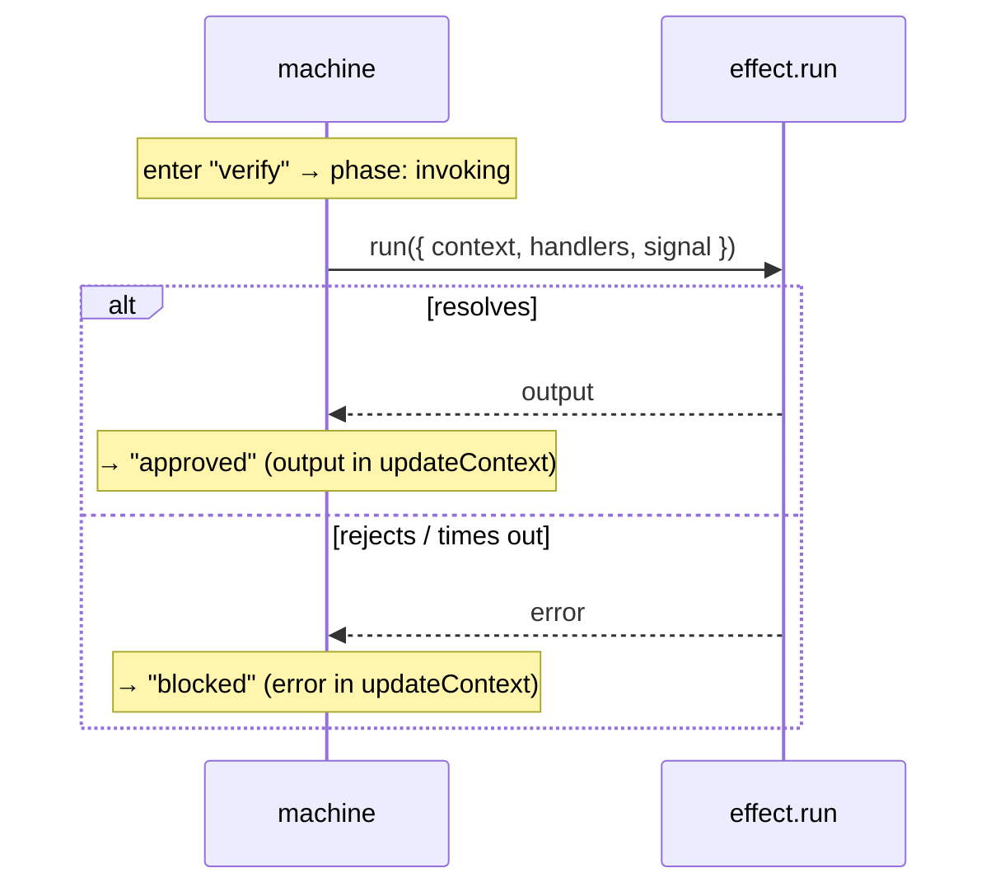

# Effects

Most flows have to _do_ something when they reach a step — call an API, load a record, verify a
token — and then branch on the result. An **effect** declares that work right on the step: the
runtime runs it on entry, tracks a loading phase you can render, cancels it if you leave, and routes
the result to the next step.

It's the piece that lets you keep async work _in the flow_ instead of scattering `useEffect`s and
loading flags across your components.

## The shape

Add an `effect` to a step. It has a `run` function and two branches — `onResolved` and `onRejected`:

```ts
createStep("verify", {
  effect: {
    run: ({ context, handlers, signal }) => handlers.verifyToken(context.token, { signal }),
    timeoutMs: 5_000,
    onResolved: {
      to: "approved",
      // `output` is the resolved value of `run`
      updateContext: ({ context, output }) => ({ ...context, plan: output.plan })
    },
    onRejected: {
      to: "blocked",
      updateContext: ({ context, error }) => ({ ...context, reason: String(error) })
    }
  }
});
```

When the machine enters `verify`, it runs `run`. On success it moves to `approved` with the
resolved `output` available to `updateContext`; on failure it moves to `blocked` with the thrown
`error`. That's the whole loop:



## When it runs

An effect runs when its step is **entered** — including the initial step on `startJourney()`, and
again on every later entry (so a back-step into the step re-runs it). Both branches are optional: a
resolved effect with no `onResolved` simply settles to idle; a rejected effect with no `onRejected`
leaves the step in the `error` phase (see [Async behavior](/docs/core/async)).

## The loading phase

While `run` is in flight, the step's async phase is `invoking`, and `async.isLoading` is `true`.
Render it exactly like a guard's `evaluating-when` phase:

```ts
const phase = machine.getSnapshot().async.byStep.verify.phase;
// "invoking" → show a spinner; "error" → show the failure; "idle" → done
```

## Cancellation

The `run` function receives an `AbortSignal` that fires when the step is left, or the machine is
reset or disposed. Forward it to your fetch/work so abandoned effects stop cleanly:

```ts
run: ({ context, handlers, signal }) => handlers.search(context.query, { signal });
```

If the effect settles after you've already left the step, its result is ignored — it can't move a
flow you're no longer on.

:::tip
`handlers` are the dependency-injected functions you pass to the definition (`handlers` on `build()`
or the definition object). Keep your I/O there — `verifyToken`, `search`, `loadProfile` — and effects
become trivially testable: swap the handlers in a test and the flow's wiring is unchanged.
:::

## Timeouts

`timeoutMs` caps the async `run`. If it doesn't settle in time, the effect rejects with a
`JourneyTimeoutError`, which flows to `onRejected` (or the `error` phase):

```ts
effect: {
  run: ({ context, handlers, signal }) => handlers.poll(context.jobId, { signal }),
  timeoutMs: 10_000,
  onRejected: { to: "timedOut" }
}
```

## Output is typed (in the builder)

With the [graph builder](/docs/core/api/graph-builder), the type of `output` is inferred from what
`run` returns — no annotation, no cast:

```ts
const { createStep, to, build } = createGraphJourneyBuilder<Context, StepId>();

createStep("loadProfile", {
  effect: {
    run: async (): Promise<{ name: string; tier: "free" | "pro" }> => api.profile(),
    onResolved: {
      to: "ready",
      // output: { name: string; tier: "free" | "pro" } — fully inferred
      updateContext: ({ context, output }) => ({ ...context, tier: output.tier })
    }
  }
});
```

In plain (non-builder) definitions, `output` is typed as `unknown` — narrow or cast it as you read
it.

## Effects in linear and graph; not headless

Effects work on **linear** and **graph** machines. They're ignored in **headless** mode, where the
caller drives navigation and there are no transitions for the effect's result to flow through.

```ts
// Linear — an effect on a step object
createLinearJourney({
  context: { token: null },
  steps: [
    "intro",
    {
      id: "fetch",
      effect: {
        run: () => api.token(),
        onResolved: {
          to: "ready",
          updateContext: ({ context, output }) => ({ ...context, token: output as string })
        }
      }
    },
    "ready"
  ]
});
```

## Effect vs. guard

Both can be async, so it's worth being clear on which to reach for:

| You want to…                                    | Use                                                                     |
| ----------------------------------------------- | ----------------------------------------------------------------------- |
| Decide whether a user-triggered move is allowed | a guard ([`when`](/docs/core/usage/graph#guards-decide-updates-derive)) |
| Do work on arrival and branch on its result     | an **effect** on the step                                               |

A guard answers "may this transition fire?"; an effect answers "I just arrived — go do the work and
route me based on how it went."

## Where to next

- [Async behavior](/docs/core/async) — the `invoking` phase alongside guards and timeouts.
- [Coming from XState](/docs/core/coming-from-xstate) — effects vs. `invoke`, side by side.
- [Recipes](/docs/core/recipes) — short patterns, including retry and error handling.
