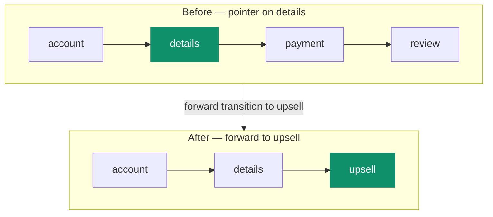

# Timeline & history

Back and forward behavior in Journey is deterministic, not guesswork, because navigation is built on
one model: a **timeline of the path actually taken** plus a **pointer** marking where "now" is on
that path.

```text
timeline:  account → details → payment → review
index:                          ▲
currentStepId:                  "payment"
```

Three fields, one rule:

- `history.timeline` — the realized path of reached steps.
- `history.index` — the pointer into that path.
- `currentStepId` — always equal to `history.timeline[history.index]`.

That rule (the third one) is an invariant: the current step is never out of sync with the pointer.
You get true history and current position at the same time, which is what makes debugging and replay
straightforward.

## What each navigation does

| Operation                       | Changes                                   | Leaves alone                        |
| ------------------------------- | ----------------------------------------- | ----------------------------------- |
| step transition                 | appends or rewrites the realized tail     | realized history before the pointer |
| `goToPreviousStep(steps?)`      | moves the pointer backward                | timeline entries, `visited`         |
| `goToLastVisitedStep()`         | moves the pointer to the realized tail    | timeline entries, `visited`         |
| headless `goToStepById(stepId)` | appends the target as a new realized step | realized history before the pointer |

Moving back never erases the timeline — it moves the pointer. That's the whole trick.

## Branching after going back

Here's the case worth understanding. When you're _not_ at the tail and a forward transition fires,
Journey truncates the timeline to the pointer, appends the new target, and moves the pointer to the
new end:



Before: `timeline = ["account", "details", "payment", "review"]`, `index = 1`.
After branching forward to `upsell`: `timeline = ["account", "details", "upsell"]`, `index = 2`.

This is exactly what people expect from a history system — go back, take a different path, and the
abandoned branch falls away.

## `visited` vs. the pointer

`visited` answers a different question than the pointer does. The pointer is "where am I now";
`visited[stepId]` is "has this step **ever** been entered." Pointer navigation doesn't rewrite
`visited`, because moving back to inspect an earlier step shouldn't erase the fact that a later one
already happened.

In UI:

- use `history.index` and `currentStepId` for current position;
- use `visited[stepId]` for "has this step happened at least once?" (lighting up a progress bar, say).

## "Back" is not a built-in event

Journey gives you pointer navigation, but it doesn't assume what `back` means for your product. The
built-ins are explicit:

- `machine.goToPreviousStep(steps?)` — pure pointer navigation.
- `machine.goToLastVisitedStep()` — jump the pointer to the realized tail.
- `machine.send({ type: "goToPreviousStep" })` — goes through the send pipeline first, then falls
  back to pointer navigation.

If you want a custom `back` event with its own transitions, declare it — `send({ type: "back" })`
only does something when your definition has matching `back` transitions. A declared
`goToPreviousStep` transition also wins over the built-in fallback, so you can override the default
when you need to.

## No-op cases

These do nothing on purpose, so you don't have to guard against them:

- `goToPreviousStep(...)` at the very start of history.
- `goToLastVisitedStep()` when you're already at the realized tail.
- any pointer helper when the machine status is terminal.

## Where to next

- [Snapshot](/docs/core/snapshot) — the full shape of `history` and `visited`.
- [Lifecycle & events](/docs/core/lifecycle) — `navigation.previous` and `navigation.lastVisited`.
- [How it works → Committing a move](/docs/core/architecture#committing-a-move) — the runtime side.
