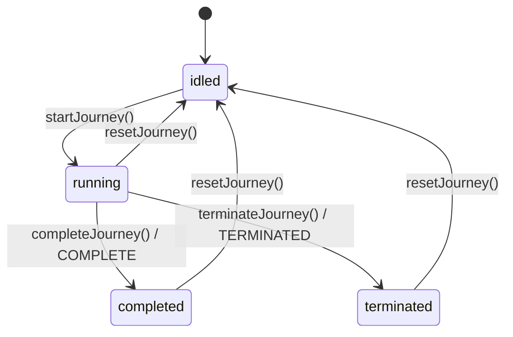
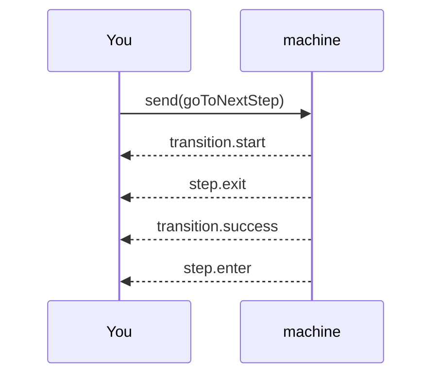

# Lifecycle & events

A machine's lifecycle has two layers, and keeping them apart will save you confusion:

- **Status** tells you what the machine is _allowed_ to do right now.
- **Events** tell you what just _happened_, in order.

You reach for status when you need a coarse gate ("can I navigate yet?"). You reach for events when
you need causality — analytics, logs, debugging.

## Status

A machine is always in exactly one of four statuses:

| Status       | Meaning                                           |
| ------------ | ------------------------------------------------- |
| `idled`      | Created, hydrated, or reset — but not started yet |
| `running`    | Normal operation                                  |
| `completed`  | Finished successfully                             |
| `terminated` | Ended early on purpose (cancel, abandon)          |



While `idled`, transitions and pointer navigation are blocked until `startJourney()`. While
terminal (`completed` or `terminated`), they're blocked until `resetJourney()`. That gating is
deliberate: a finished flow shouldn't quietly accept another "next."

A fresh machine starts from a known idle snapshot — `timeline: [initial]`, `index: 0`,
`currentStepId: initial`, `visited[initial]: true`, `status: "idled"` — which is why behavior is
reproducible across environments. `startJourney()` moves it to `running` and emits `journey.start`;
`resetJourney()` commits a clean idle snapshot and emits `journey.reset`. Late subscribers don't get
a replayed startup event.

## The event catalog

Subscribe with `subscribeEvent(...)`:

| Event                    | Fires when                                             | Key payload                                           |
| ------------------------ | ------------------------------------------------------ | ----------------------------------------------------- |
| `journey.start`          | `startJourney()` moves `idled → running`               | `stepId`                                              |
| `journey.reset`          | `resetJourney()` commits the idle snapshot             | `stepId`                                              |
| `transition.start`       | an event begins running through the send pipeline      | `from`, `event`                                       |
| `transition.success`     | a transition commits or a fallback send succeeds       | `from`, `to`, `eventType`, `transitionId`, `label`    |
| `transition.error`       | a selected guard or `updateContext` fails or times out | `from`, `eventType`, `transitionId`, `label`, `error` |
| `step.exit`              | the machine leaves the current step                    | `stepId`                                              |
| `step.enter`             | the machine enters a different step                    | `stepId`                                              |
| `journey.completed`      | the machine reaches `completed`                        | `stepId`                                              |
| `journey.terminated`     | the machine reaches `terminated`                       | `stepId`                                              |
| `navigation.previous`    | the pointer moves backward                             | `from`, `to`, `requestedSteps`, `appliedSteps`        |
| `navigation.lastVisited` | the pointer jumps to the realized tail                 | `from`, `to`                                          |

:::note Effects and `after` route through internal events
Step [effects](/docs/core/effects) and [delayed `after` transitions](/docs/core/effects#delayed-transitions-after)
move the flow through **internal synthetic events** (an `@@journey.*` namespace). Those are an
implementation detail: they are **not** delivered to `subscribeEvent`, so you won't see a
`transition.start`/`transition.success` for them. The navigation they produce is still fully
observable as `step.exit` / `step.enter`. Don't depend on the `@@journey.*` names — they're internal
and may change.
:::

## Event order

Ordering is guaranteed, which is what makes events reliable for analytics. A normal step-to-step
transition emits:



A same-step transition (`a → a`) still emits `transition.start` and `transition.success`, but skips
`step.exit` and `step.enter` — you didn't actually leave.

**A failed guard or context update** emits `transition.start`, then `transition.error`, and commits
nothing:

```text
send(event) → transition.start → (guard / update fails) → transition.error → no commit
```

**A terminal transition** emits `transition.start`, `transition.success` (with `to: "COMPLETE"` or
`"TERMINATED"`), then `journey.completed` or `journey.terminated`.

**Pointer helpers** skip transition matching, so their stream is navigation-focused:

```text
goToPreviousStep(2) → step.exit → navigation.previous → step.enter
```

If previous-step navigation happens as a _fallback_ from `send({ type: "goToPreviousStep" })`, that
send still emits `transition.start` before the navigation sequence and `transition.success` after.

## Step lifecycle callbacks

For straightforward enter/leave side effects, attach `onEnter` and `onLeave` to a step instead of
subscribing to events. Both receive `{ context }`:

```ts
const machine = createLinearJourney({
  context: { username: "" },
  steps: [
    {
      id: "login",
      onLeave: ({ context }) => analytics.track("login_left", { user: context.username })
    },
    {
      id: "dashboard",
      onEnter: () => analytics.track("dashboard_entered")
    }
  ]
});
```

With the graph builder, the callbacks sit alongside transitions on the step:

```ts
const dashboard = createStep("dashboard", {
  onEnter: () => analytics.track("dashboard_entered"),
  on: { submit: [to("review")] }
});
```

:::warning
Callbacks are **observational**. They run after the transition commits and can't block or roll it
back. If one throws, Journey logs a development diagnostic and leaves the committed result
unchanged — it does not emit `transition.error`. When a transition itself must derive new state, use
its `updateContext`, not a callback.
:::

Terminal transitions follow the same path: if `completeJourney` or `terminateJourney` is backed by a
declared transition with `onLeave`/`onEnter`, those run before the machine settles. (React-specific
step hooks live in `@rxova/journey-react`; this page is the core runtime contract.)

### Chaining with `dispatch`

Callbacks receive more than `context` — they also get a `dispatch` function and an `AbortSignal`.
`dispatch` sends a follow-up event through the same serialized queue, which lets a step chain the
flow forward on entry:

```ts
createStep("review", {
  onEnter: ({ context, dispatch }) => {
    if (context.autoApprove) {
      dispatch({ type: "approve" }); // queued; runs after this entry settles
    }
  }
});
```

This is Journey's equivalent of a raised self-event. Keep it deliberate — a callback that
unconditionally dispatches an event that leads back to itself will loop.

## Observe it

```ts
const unsubscribe = machine.subscribeEvent((event) => {
  if (event.type === "journey.start") {
    console.log("started at", event.stepId);
  }
  if (event.type === "transition.success") {
    console.log("moved", event.from, "→", event.to, `(${event.eventType})`);
  }
  if (event.type === "journey.completed") {
    console.log("completed at", event.stepId);
  }
});
```

## Where to next

- [Step behavior](/docs/core/usage/step-behavior) — `onEnter`/`onLeave` next to `when`, `effect`, and `after`, with a per-mode availability map and the full `updateContext` catalog.
- [Snapshot](/docs/core/snapshot) — the state object these events explain.
- [Async behavior](/docs/core/async) — failure and timeout semantics behind `transition.error`.
- [Timeline & history](/docs/core/history) — `navigation.previous` and `navigation.lastVisited`.
