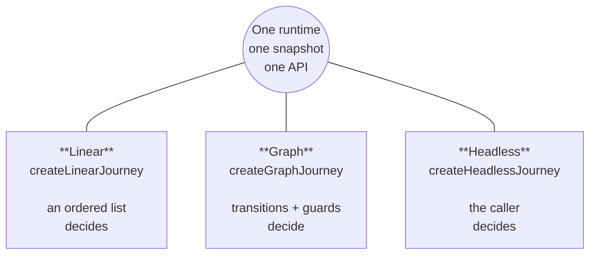

# Overview

Journey is a flow runtime for products that need more than "next" and "back."

Real flows don't come in one shape. A signup wizard runs top to bottom. A verification flow
branches, retries, and loops. A server-driven onboarding decides the next step from an API
response or a feature flag, with no fixed map at all. Most tools are built for exactly one of
those shapes and make the other two awkward.

Journey is the one runtime behind all three. You model the flow you have instead of bending it to
fit the tool, you keep a single mental model as it grows, and you drop it into the rest of your app
without ceremony.

:::tip The core promise
Define your flow once. Drive it predictably. Inspect it completely.
:::

## Why a runtime at all {#motivation}

Whatever shape your flow takes, three problems show up every time. Journey solves all three in one
place; most alternatives leave at least one to you.

- **A snapshot you can trust.** One serializable object holds the current step, history, context,
  status, visited steps, and async state. You can persist it, resume it, send it to devtools, or
  assert on it in a test. Spread that same state across component hooks and there's no single value
  to point at and call "the state of the flow."
- **Transition rules in one place.** Movement is decided by data on the transition, not by
  whichever button handler fires. When the rule lives with the transition, "how do we get from A to
  B?" is answerable by reading one definition instead of tracing through several components.
- **Async as part of the model.** Flows gate on network checks, validation, and eligibility calls.
  Journey models those with explicit phases, timeouts, and per-step error state — not a `loading`
  boolean added at render time.

Here's where the common alternatives stop:

- **Component state** (`useState`/`useReducer`) gets you moving fast, then leaves all three
  problems for you to wire up by hand.
- **A router** gives you navigation but ties the flow to URLs, and hands you the snapshot and async
  story to solve yourself.
- **A full statechart engine** gives you transitions and async, but asks you to model everything as
  a graph — heavy for a wizard, awkward for caller-driven navigation.

Journey gives you all three — snapshot, transition-first rules, first-class async — and lets the
flow keep whatever shape it has.

## Three modes, one runtime

A graph engine forces every flow into a graph. A wizard library can't branch. Journey takes a
different path: **three factories over one runtime**, so the API matches your flow's shape instead
of fighting it. All three produce the same snapshot, the same async semantics, and the same
observability. They differ in one thing — **who decides the next step.**

| Mode         | Factory                 | Who decides the next step              | Solves                                                        |
| ------------ | ----------------------- | -------------------------------------- | ------------------------------------------------------------- |
| **Linear**   | `createLinearJourney`   | An ordered list of steps               | Fixed, top-to-bottom flows: wizards, checkouts, onboarding    |
| **Graph**    | `createGraphJourney`    | Transitions + guards on the definition | Branching, conditional routing, retries, loops, custom events |
| **Headless** | `createHeadlessJourney` | The caller, at runtime, per move       | Flows whose path is computed elsewhere (server, flags, tests) |

Each mode constrains the same machine differently. Linear derives transitions from step order, so
`goToNextStep` advances the sequence. Graph asks you to declare transitions, so the path stays
explicit and inspectable. Headless declares no transitions and hands navigation to the caller.

### Navigation API per mode

Every mode exposes the full machine API — reading the snapshot, subscribing, updating context,
completing or terminating, async handling. What changes is **which navigation calls carry meaning**:

| Method                       | Linear            | Graph                 | Headless             | What it does                                              |
| ---------------------------- | ----------------- | --------------------- | -------------------- | --------------------------------------------------------- |
| `goToNextStep()`             | ✅ primary driver | ✅ follows transition | ⛔ no-op¹            | Advance via the matching `goToNextStep` transition        |
| `goToPreviousStep(steps?)`   | ✅                | ✅                    | ✅                   | Step back through history                                 |
| `goToStepById(id)`           | ✅²               | ✅ if edge defined    | ✅ primary driver    | Jump to a specific step                                   |
| `goToStepByIndex(i)`         | ✅ (linear only)  | —                     | —                    | Jump by position in the ordered step list                 |
| `send(event)`                | built-ins only    | ✅ custom events      | ⛔ built-ins, no-op¹ | Drive a custom, named transition (graph's differentiator) |
| `completeJourney(payload?)`  | ✅                | ✅                    | ✅                   | Move to a terminal "completed" state                      |
| `terminateJourney(payload?)` | ✅                | ✅                    | ✅                   | End the journey without completing (cancel/abandon)       |
| `resetJourney()`             | ✅                | ✅                    | ✅                   | Return to the initial snapshot                            |
| `updateContext(updater)`     | ✅                | ✅                    | ✅                   | Patch context immutably                                   |
| `clearStepError(id?)`        | ✅                | ✅                    | ✅                   | Clear async/validation error state for a step             |
| `getSnapshot()`              | ✅                | ✅                    | ✅                   | Read the current authoritative snapshot                   |
| `subscribe* / dispose`       | ✅                | ✅                    | ✅                   | Observe snapshots, events, lifecycle; tear down           |

> ¹ Headless declares no transition graph, so `goToNextStep()` and custom `send(...)` have nothing
> to match and resolve to a no-op until you add transitions (moving toward linear or graph).
>
> ² Forward jumps in Linear succeed only when a `goToStepById` transition exists for that edge;
> otherwise the call reports `transitioned: false`.

:::info
You're not locked in. A linear wizard often grows transitions and becomes a graph; a UI-bound flow
often benefits from a headless runtime boundary later. Because the snapshot and runtime are
identical, moving between modes is a change to the definition, not a rewrite.
:::

## Design principles

| Principle                 | What it means                                                                                                                           |
| ------------------------- | --------------------------------------------------------------------------------------------------------------------------------------- |
| 🧭 **Transition-first**   | Movement rules live on transitions, not scattered across button handlers — keeping intent visible and reviewable.                       |
| 📸 **Snapshot-persisted** | Runtime state lives in one snapshot: current step, history, context, status, visited state, and async state.                            |
| 🏷️ **ID-based**           | Steps are referenced by id like `"details"` or `"review"`, never by array position, so reordering or branching keeps navigation intact. |
| 👁️ **Observable**         | Snapshot subscriptions for rendering, lifecycle events for telemetry — each at the right level of detail.                               |
| ⏳ **Async-safe**         | Async guards are part of the model, with explicit phases, timeout support, and per-step error state.                                    |

## Under the hood

### The event pipeline

Journey processes events through a serialized queue. One event starts, its matching transition
resolves, async work settles, the snapshot commits — and only then does the next queued event
begin. No overlapping mutations, no half-applied state.

### Definition vs. snapshot

The runtime keeps two concerns apart: the static definition (what the flow _is_) and the live
snapshot (where things _are_). Definitions stay small and readable; the snapshot stays the single
authoritative place to inspect current state.

## Where to next

- [Quickstart](/docs/core/getting-started) — install, define a flow, and drive it in a few minutes.
- [Core concepts](/docs/core/concepts) — the vocabulary every other page builds on.
- [Choosing a mode](/docs/core/usage) — pick linear, graph, or headless for your flow.
- [How it works](/docs/core/architecture) — a guided tour of the runtime internals.
