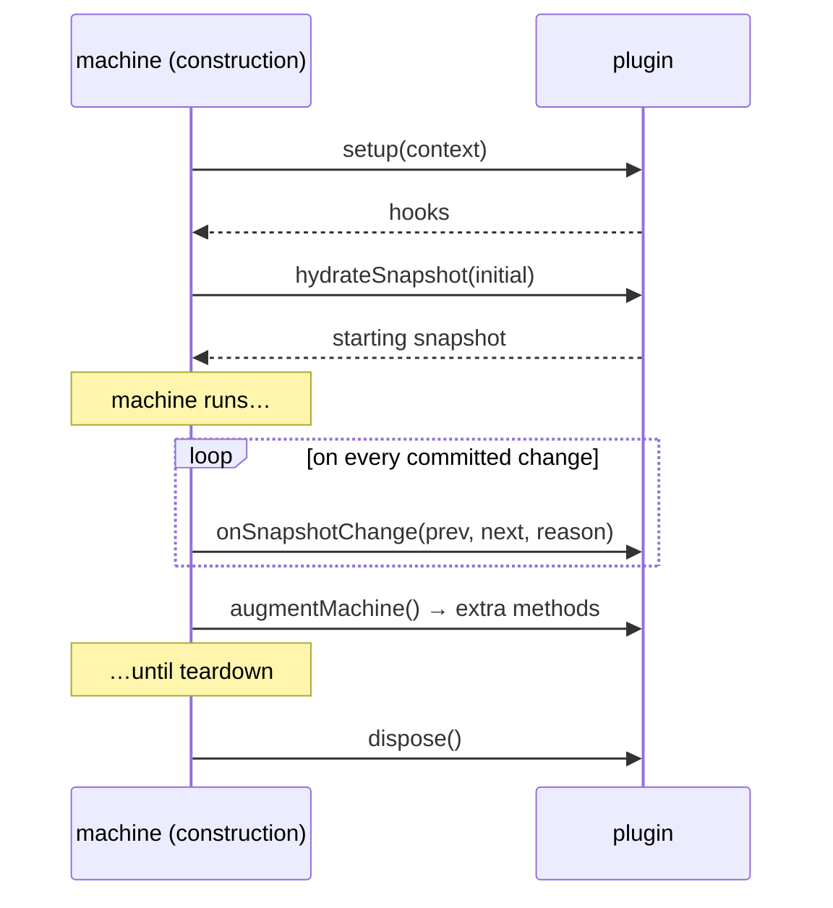

# Plugins

Plugins are how Journey stays small by default and grows when your runtime needs more. The base
machine handles transitions, navigation, snapshots, async, and lifecycle events. Everything
else — persisting state, autosaving drafts, normalizing analytics, recording sessions, validating
structure — is a plugin you opt into.

## Why opt-in

Some capabilities matter a lot to some teams and not at all to others. Plenty of flows need
resume-later persistence; plenty don't. Execution-path analysis is gold for tooling and CI, but it
shouldn't make every machine heavier for people who never call it. Keeping these as plugins means
the base runtime stays lean, and you pay only for what you use.

## How a plugin hooks in

A plugin is an object with a `name` and a `setup` function. During machine construction, Journey
runs `setup` once and uses the hooks it returns at specific moments in the machine's life:



In practice a plugin can:

- inspect the resolved definition during setup;
- hydrate or adjust the starting snapshot (this is how persistence loads saved state _before_ the
  runtime owns its first snapshot);
- react to every snapshot change;
- add new methods to the machine.

That's enough to support both "react to runtime changes" plugins (analytics, autosave) and "extend
the machine API" plugins (diagnostics, replay, execution paths).

## Adding plugins

Plugins go in the options argument of any factory — linear, graph, or headless:

```ts
import { createGraphJourney } from "@rxova/journey-core";
import { createPersistencePlugin } from "@rxova/journey-core/persistence";
import { createAutosavePlugin } from "@rxova/journey-core/autosave";
import { createAnalyticsPlugin } from "@rxova/journey-core/analytics";
import { createReplayPlugin } from "@rxova/journey-core/replay";
import { createDiagnosticsPlugin } from "@rxova/journey-core/diagnostics";
import { createExecutionPathsPlugin } from "@rxova/journey-core/execution-paths";

const machine = createGraphJourney(journey, {
  plugins: [
    createPersistencePlugin({ key: "checkout", version: 2 }),
    createAutosavePlugin({ key: "checkout-draft" }),
    createAnalyticsPlugin({ track: (event) => analytics.track(event.name, event.payload) }),
    createReplayPlugin(),
    createDiagnosticsPlugin(),
    createExecutionPathsPlugin()
  ]
});
```

Each is published from its own entry point, so you only ship the ones you import.

## The built-in plugins

| Plugin                                                       | Reach for it when…                                                                     |
| ------------------------------------------------------------ | -------------------------------------------------------------------------------------- |
| [Persistence](/docs/core/persistence)                        | the machine should hydrate from storage and survive reloads.                           |
| [Autosave](/docs/core/autosave)                              | you want debounced draft saving with a save-status API for the UI.                     |
| [Analytics](/docs/core/plugins/analytics-plugin)             | you want normalized lifecycle events sent to your analytics client.                    |
| [Replay](/docs/core/plugins/replay-plugin)                   | you want an in-memory recording of snapshots and events for debugging or bug reports.  |
| [Diagnostics](/docs/core/plugins/diagnostics-plugin)         | you want structural checks (unreachable steps, dead ends, cycles) during authoring/CI. |
| [Execution paths](/docs/core/plugins/execution-paths-plugin) | you want to enumerate the declared paths through a flow without running it.            |

## A few guidelines

- Reach for a plugin when a capability is optional, cross-cutting, or tooling-oriented.
- Keep transition logic in the journey definition, not in plugins — a plugin extends the runtime, it
  doesn't replace clear transition modeling.
- Depend on documented plugin hooks and published entry points, not on internal machine internals.

Compatibility expectations for plugins live in the shared
[Stability contract](/docs/core/stability).

## Where to next

- [Writing a plugin](/docs/core/plugins/authoring) — build your own, hook by hook.
- [How it works → Plugins](/docs/core/architecture#plugins) — the controller that wires them in.
