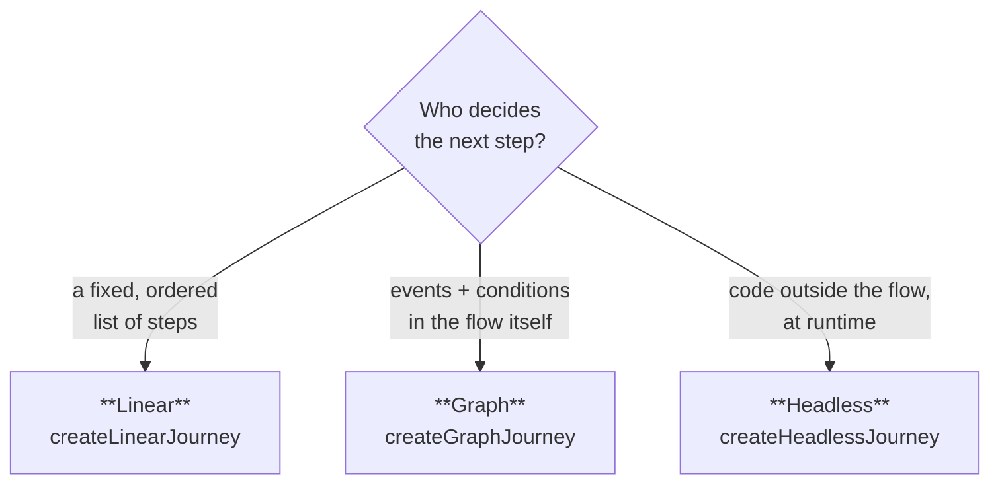

# Choosing a mode

Journey has three factories, and picking the right one is the first decision you'll make. The good
news: it's a low-stakes decision. All three share the same runtime, the same snapshot, and the same
observable API — so if you guess wrong, switching is a change to the definition, not a rewrite.

Here's the question that sorts it out: **who decides the next step?**

| Mode                       | Reach for it when                                                                                         |
| -------------------------- | --------------------------------------------------------------------------------------------------------- |
| [**Linear**](./linear)     | The path is a fixed sequence. "Next" always means the same thing. Onboarding, checkout, multi-step forms. |
| [**Graph**](./graph)       | The path branches on events or conditions — retries, approvals, conditional routing, custom events.       |
| [**Headless**](./headless) | The next step is computed elsewhere (a server response, a flag, an experiment) and the caller navigates.  |

## The spectrum

These modes aren't three separate products bolted together — they're points on one spectrum, from
"the flow decides everything" to "the caller decides everything":

- **Linear** is the most constrained: you give an order, Journey derives the moves.
- **Graph** loosens that: you declare which events lead where, with guards.
- **Headless** removes the constraint entirely: no transitions, the caller jumps wherever it wants.

A flow tends to drift rightward as product rules pile up. A linear checkout grows a "skip this step
for VIPs" rule and becomes a graph. A graph flow gets wrapped by an orchestrator that decides steps
from server state and goes headless. Because the runtime underneath is identical, that drift is a
refactor of your definition — your rendering, persistence, and analytics keep working.

:::tip
Not sure? Start with the simplest mode that fits today. Linear if it's a sequence, graph the moment
it branches. You won't paint yourself into a corner.
:::

## What stays the same across modes

Whichever you pick, you get the same machine underneath:

- one [snapshot](/docs/core/snapshot) shape to render and persist;
- the same [lifecycle events](/docs/core/lifecycle) for analytics and logging;
- the same [async model](/docs/core/async) for guards, loading, and timeouts;
- the same [plugins](/docs/core/plugins/overview).

What changes is the input you author and which navigation calls carry meaning — the
[Overview's navigation table](/docs/core/overview#navigation-api-per-mode) lays that out call by call.

## Where to next

- [Linear](./linear) — ordered sequences, the wizard workhorse.
- [Graph](./graph) — branching, guards, and custom events.
- [Headless](./headless) — caller-driven navigation.
