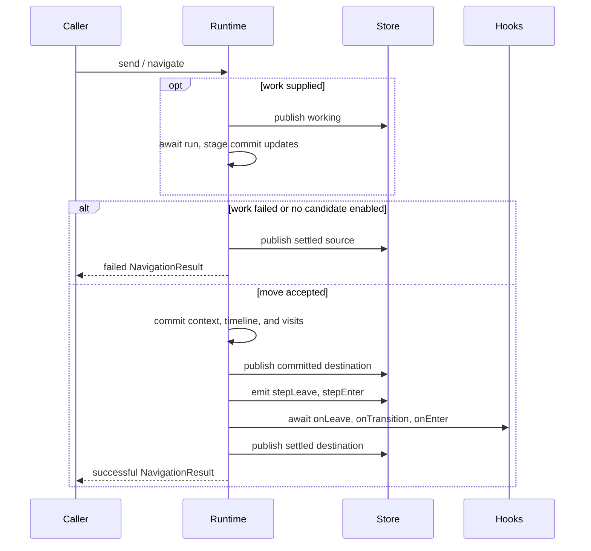

Journey splits decision-making sharply: guards are synchronous and pure; everything asynchronous
that must succeed before movement is transactional **work**; side effects run post-commit and
cannot block.

## Sync, pure guards

A graph transition's `when({ context, handlers })` guard runs synchronously and must stay pure,
because guards are evaluated both while routing a send and while deriving snapshot fields
(`availableEvents`, `availableSteps`, `outgoingTransitions`). A throwing guard is treated as
disabled.

## Sending a graph event

`send(type, payload?)` follows this selection path:

1. Reject if disposed, not running, or already transitioning.
2. Scan flattened transitions in declaration order.
3. Match event type and current `from` id.
4. Evaluate the synchronous guard, if present.
5. Run navigation with the first enabled candidate.

No match returns `no-enabled-transition`.

## Transactional work

Next/previous navigation and builder-declared work-sends carry the same transaction shape: an
asynchronous `run` executes first, an optional synchronous `commit` stages a context update, and
the move is decided afterwards — all-or-nothing.

For a work-send, candidate guards are evaluated **against the staged context**, and in the
candidates-callback form they additionally receive the typed **result of `run`**:

```ts
b.createStep("review", {
  on: {
    submit: ({ work }) =>
      work({
        run: async ({ context, handlers }) => handlers.verify(context),
        candidates: ({ to, stay }) => [
          to("done").when(({ result }) => result.ok),
          stay() // totality fallback
        ]
      })
  }
});
```

Control-flow intermediates never need to be laundered through persistent context: read them from
`result`. Resting-state introspection (`outgoingTransitions`) evaluates result-reading guards with
`result: undefined`.

If `run` throws, rejects, or times out — or no candidate is enabled — nothing commits: the machine
stays on the source step and staged context updates are discarded. The caller receives a failed
`NavigationResult`.

## `stay()` totality

`stay()` is an unguarded candidate pointing back at the declaring step — the named totality
fallback. The builder's `build()` emits a dev-mode warning when a work declaration has no unguarded
fallback candidate; `allowRollback: true` silences it when discarding the work result on rollback
is intended.

## Committing a move



Pointer moves update only `currentIndex`. Appending a destination truncates timeline entries after
the pointer, then appends the new id.

## Async state

The runtime exposes three related views:

- `snapshot.machine.isLoading` is the canonical UI-level pending flag;
- `snapshot.transition` describes the whole pending operation (`working`, `leaving`, or
  `entering`);
- `snapshot.currentStep.async` describes navigation work or lifecycle effects.

Navigation work runs before commit and may stop movement. `onLeave`, graph `onTransition`, and
destination `onEnter` run after commit, in that order. Their failure is stored on the destination
and emitted as an `error` event without rollback.

## Where to next

- [Effects](../effects)
- [Transitions syntax](../api/transitions-syntax)
- [Graph builder](../api/graph-builder)
