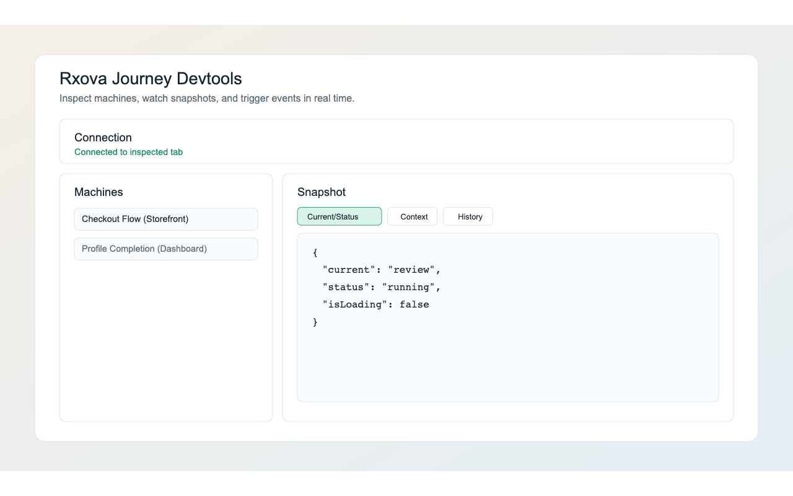

Journey devtools has two parts:

- `@rxova/journey-devtools-bridge`: runtime message bridge.
- Devtools panel app: visualization + controls.

## Download Extension

Install the extension from Chrome Web Store:

- https://chromewebstore.google.com/detail/rxova-journey-devtools/bkmdccobpcagbmknjmmhbabcfphinjcm

Preview:

## Why It Exists

The devtools stack helps teams see journey behavior clearly: timeline movement, transition outcomes, async phases, and command outcomes.

## Protocol Version

Bridge protocol version is **4**. The panel shows a compatibility warning when the inspected app reports a different protocol version.

## Command Surface

The panel can drive navigation, lifecycle controls, error clearing, custom event sending, and read-only execution path queries through the bridge. The `getExecutionPaths` query remains available even when mutating commands are disabled.

See full details in [Bridge API](../bridge/bridge-api.md) and exact transport types in [Protocol](../bridge/protocol.md).

## Snapshot Payload Focus

Panel state is driven by serialized machine snapshots including:

- history pointer model (`history.timeline`, `history.index`)
- current position (`currentStepId`)
- runtime state (`context`, `visited`, `status`, `async`)

For a full payload example, see [Bridge API](../bridge/bridge-api.md).

## Time Travel UX

Panel supports:

- Redux-style timeline inspector rows with local selection
- follow-latest toggle and point-in-time `Action` / `State` / `Diff` inspection

Inspector selection does not mutate runtime machine state.
